# AI 워크플로우(workflow) 서버 구축 후기

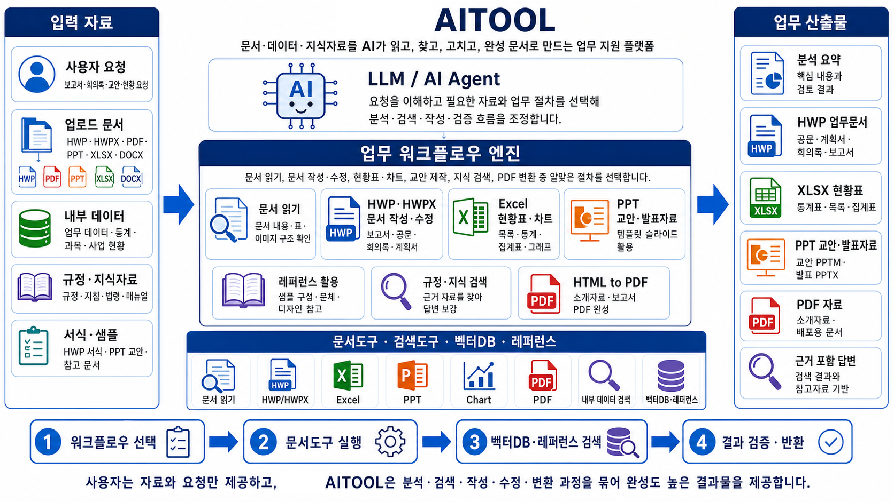

 IT로 밥벌이를 하다보니 최근에 몰아친 AI광풍에 생존을 위한 몸부림을 치고 있습니다. ChatGPT가 나온뒤로 한두달, 때로는 일주일 단위로 뭔가 새로운 기술이나 서비스들이 생겨나며 빠른 속도로 변화하다 보니 공부하고 시험해보느라 시간이 어떻게 지나가는지도 모르는 삶을 살고 있는 거 같아요. 이젠 좀 쉬어가면 좋겠다는 생각이 들지만 세상은 더 빠르게 변하고 있는거 같습니다. 

 저는 어쩌다보니 CTO(Chief Technology Officer)까진 아니지만 비슷한 일을 해야하는 입장이라 IT트렌드에 따라 어느 방향으로 가야 할지, 어떻게 준비해 가야 할지를 같이 고민해야 하는데 요즘처럼 변화가 많은 시기엔 고민해야될것들이 너무 많아 젊을 때보다 더 바쁘게 살고 있는거 같습니다. AI는 정보기술의 집약체이고 너무 빨리 발전하다보니, 그냥 지켜보고 있다가 투자해서 확 바꾸는식의 사업진행은 힘들어 보였거든요.(작은기관이라 그럴만한 돈도 없고요~)

 2026년은 Agent AI로의 전환이 중요해 보였고, 업무에 AX(AI Transformation)를 어떻게 시도할 것인가를 고민하다 결국 워크플로우 서버 구축까지 가게되었고, 쉬어가는 느낌+기록보관 차원에서 블로그에 흔적을 남겨보고자 합니다.

​

<b>AI용 업무 플랫폼을 따로 만들어야 하는가?</b>

 저희 회사는 고등교육기관, 일명 "학교"이고 실제 업무는 행정과 교육이 대부분을 차지합니다. 여러 문서를 읽어야 하고 규정이나 법률에서 근거를 찾아야 하며 HWP, PDF, XLS, PPT같은 다양한 문서들을 다루어야 합니다. 워크플로우 서버는 이런 업무에 필요한 작업을 AI가 어떻게 지원하게 할건지에 대한 고민에 따른 출발점이며 정해진 절차와 전용 도구를 통해 문서를 읽고 정보를 검색하고, 내용을 작성하거나 변환할수 있도록 구성하였습니다.

  우리가 흔하게 쓰는 AI, 즉 LLM(Large Language Model)은 문맥을 정리하고 초안을 작성하는 데 탁월한 능력이 있습니다만 단순히 내용을 생성하는 것만으로는 '사람이 편하게'라는 AX의 목적을 이루기 어렵습니다. 최종 결과물은 HWP, PDF, PPT같은 파일들이니 시스템이 이 파일들을 다룰수 있어야 하고 표, 글자스타일, 이미지 삽입 등 문서작업에 필요한 기능들을 지원해주어야 한다는 결론에 도달했었습니다.

  그래서 AI의 판단과 파일 처리 기능을 분리하도록 설계했고 파일 포맷별 전용도구를 개발해 유틸리티 서버를 구축하고 AI는 사용자의 요청에 따라 이 도구를 사용할 수 있도록 구성하였습니다. 보수적인 공공기관에서는 오래전부터 내려오는 표현기법같은 관행적 문화들이 있기에 검색과 레퍼런스 기능을 통해 결과물의 내용과 형식을 보강해주어야 합니다. 중앙 서버는 도구의 버젼과 접근 범위를 일관되게 관리하고 안내 프롬프트는 AI가 필요한 절차를 빠르게 이해하도록 돕습니다.

​
​
​

<b>개별 MCP서버 대신 중앙 서버로?</b>

  Claude나 ChatGPT같은 범용 LLM의 성능은 상상이상으로 빠르게 높아지고 있습니다. 짧은 시간에 대량의 문서를 이해하고 정리해서 사용자의 요청에 맞는 내용을 작성해주는건 사람이 절대 따라갈수 없는 능력입니다. 하지만 기관에서는 내부 결재나 보고서식, 기관 고유의 업무형식과 문체, 기존 문서의 구조 유지, 내부자료에 대한 접근 통제를 함께 고려해야 하고 업무별 필요한 기능과 정보를 연결하고 관리하기 위해서는 중앙에 모아두는 것이 현실적이다는 결론입니다.

  또한 모든 사용자의 개인 장비에 문서 처리용 도구를 MCP(Model Context Protocol)서버로 설치하는건 불가능에 가깝습니다. 새로 생긴 기술을 전공자도 아닌 일반 사용자에게 바로 적용하는건 큰 모험이며 개인 PC의 성능문제까지 AX비용에 포함되는 위험한 방법이라 판단되었습니다.  정보검색, 파일변환 기능은 내부망 서버에 모아서 운영하고 내부망에서 제공되는 "안내용 프롬프트 파일" 1개만 AI가 읽게 하면 WorkFlow를 따라갈 수 있게끔 구성했습니다. 개별 장비의 복잡한 설정도 필요없고, 정해진 범위 안에서 AI를 활용해 업무를 수행할 수 있게 되는 방식입니다.

  이 방식은 특정 LLM에 종속되지 않고 클로드, ChatGPT, 제미나이, 오픈소스 AI 등 어떤 LLM에 관계없이 정해진 워크플로우를 따라 같은 도구를 사용할 수 있으므로 LLM 변동에 따른 유지보수 리스크를 최소화 하는 구조입니다. 그리고 내부 규정, 관련 법령, 등록 서식, 업무 데이터베이스 등 다른 체계와 연결이 용이하고 AI시대에 흔히 말하는 "딸깍해서 생성"하는 업무에서 부터 다양하게 축적된 데이터를 비교분석해서 결과를 도출하는, 고급사용자의 요구까지 대응할 수 있는 기반 시스템이기도 합니다.

​

​
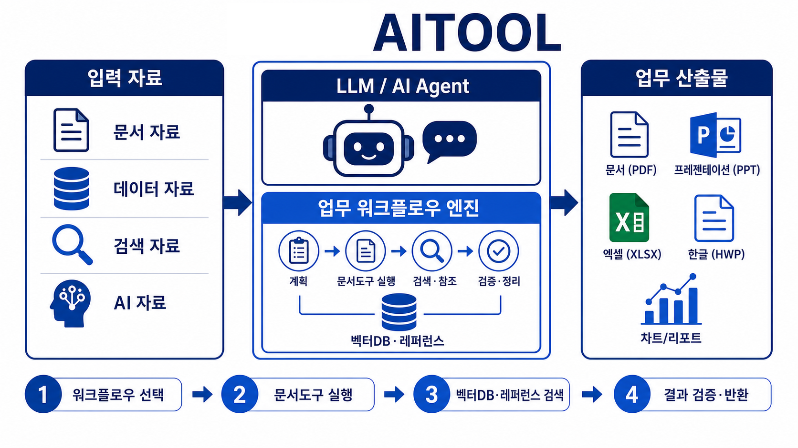

<b>워크플로우 : AI가 올바르게 도구를 쓰게 하는 역할</b>

  이 방식에는 최근 빠르게 발전하는 에이전트형 AI 소프트웨어의 흐름이 반영되어 있습니다. "헤르메스(Hermes)" 같은 에이전트형 도구가 확산되면서 AX의 관점에서는 모델 자체의 성능도 중요하지만 AI가 어떤 도구를 어떤 규칙과 순서로 사용할 수 있게 할 것인지가 중요하다 보았습니다. 2026년에 나타난 "하네스 엔지니어링(Harness Engineering)"은 AI가 업무를 수행할 수 있도록 도구, 지침, 검증 절차 등을 하나의 실행환경으로 설계하는 방식입니다.

  워크플로우 서버는 이 환경의 중심역할을 수행합니다. 여러 API를 한곳에 모아 둔 목록을 관리하는게 아니라, 사용자의 요청을 분석해 어떤 흐름이 적합한지 선택하고 그 작업에 필요한 안내와 규격만 AI에게 전달하는 조정자 입니다. AI는 안내 프롬프트에 따라 사용 원칙을 먼저 확인하고 전체 기능 문서를 읽는 대신 워크플로우 서버가 정해준 업무의 규칙, 서식, 입력 형식 등을 확인하고 작업을 수행합니다.

  예를 들어 "OOO에 대한 회의록을 작성해"라는 요청이 발생할 경우 AI는 워크플로우 서버를 통해 등록된 HWP양식을 안내받고 작성에 필요한 JSON(JavaScript Object Notation) 스키마를 확인하며 레퍼런스 API에게 요청해 회의록 샘플을 확인해서 구성방식이나 문체를 확인하여 내용을 작성하게 됩니다. 작성된 내용은 JSON으로 변환해 중앙서버에 전송하여 오류를 검증한 뒤 등록서식 작성 API를 통해 완성된 파일을 사용자에게 전송하도록 처리합니다. 

  현재 정의된 주요 업무 흐름은 아래와 같습니다.

##문서파일 읽기

- PDF, HWP, HWPX, Word, PowerPoint, Excel, PDF 파일을 Markdown·텍스트·JSON으로 추출합니다.

##이미지 해석

- 이미지의 내용과 보이는 텍스트를 구조화해 검색이나 문서 이해에 활용합니다.

##등록 서식 작성

- 기안문, 회의록, 계약서, 분석서·기획서, 개발계획서처럼 규정에 등록된 서식을 이용해 문서를 만듭니다.

##레퍼런스 조회

- 기안문, 회의록 등 자주 사용하는 문서를 대상으로 기존 샘플의 구성, 표현 밀도, 표 형태, 스타일 단서를 확인해 새 문서의 품질을 보완합니다.

##문서파일 편집

- HWP, HWPX, XLSX, PPTX 파일별 JSON 구조와 전용 수정 기능을 사용해 새로운 파일을 만들거나 기존 문서를 수정합니다.

##강의교안 작성

- 과목 개발시 사용되는 개인별 교안 템플릿과 사전 정의된 교안 슬라이드 형식을 사용해서 강의 내용을 PPT파일로 제작합니다.

##차트 이미지 생성

- 표 형태의 데이터를 공통 차트 형식으로 전달받아 문서와 발표자료에 넣을 수 있는 이미지로 제작합니다.

##HTML to PDF변환

- HTML 기반 소개자료와 보고서를 배포용 PDF로 변환합니다.

##내부 데이터 검색

- 내부 시스템에 등록된 조회 항목을 이용해 업무 데이터와 조건별 통계를 자유롭게 생성하여 가져옵니다.

##벡터 기반 지식 검색

- 규정, 법령, 행정규칙, 각종 계획서 등 축적된 지식자료에서 질문과 의미가 가까운 근거를 찾습니다.

  이처럼 워크플로우는 AI가 어떤 순서로 어떤 자료를 어떤 도구를 이용해서 작업할 것인지 정하는 역할을 하고 도구가 많아질 수록 이 조정 역할은 결과의 일관성과 AI 사용 효율을 높일수 있는 기반 시스템입니다. 중앙 서버에서 workflow를 관리하면 새로운 도구나 업무절차가 추가되더라도 사용자는 AI에게 프롬프트를 읽게 하는 지시만 그대로 수행하면 됩니다.

​

​

​

<b>Tool API의 공통 규칙</b>

  방법을 지정해 주는 건 워크플로우의 역할이지만 실제 결과물을 만드는 것은 유틸리티 서버입니다. 각 문서 유형(HWP, HWPX, XLSX, PPTX)별 API는 다르지만 사용 규칙은 동일하게 구성하였습니다. AI는 워크플로우가 알려준 도구를 찾고 해당 도구의 도움말과 스키마를 확인합니다. 도움말에는 지원 기능, 사용 순서, 주의사항을 설명하고 스키마는 어떤 항목을 어떤 JSON 형태로 구성해야 하는지를 정의합니다. 기존 파일을 수정하는 작업인 경우에도 해당 API를 통해 정해진 스키마의 JSON으로 구조화하여 수정할 대상과 변경 범위를 확인합니다.

​
공통흐름은 다음과 같습니다.

##1. 적합한 워크 플로우와 Tool API를 선택
 - 사용자 요청이 문서 읽기, 등록 서식 작성, 기존 파일 수정, 검색, 변환 중 어디에 해당하는지 구분

##2. 상태와 사용 방법을 확인
 - health, help, schema 등 도구가 제공하는 안내를 통해 서비스 상태, 지원 기능, 입력 규격을 확인

##3. 필요한 원본과 참고자료를 확인
 - 기존 문서를 수정할 때는 원본 구조를 읽고, 규정 문서를 작성할 때는 등록 서식과 레퍼런스를 확인

##4. 요청 JSON을 작성하고 검증
 - 내용, 표, 스타일, 차트, 검색조건 등 작업에 필요한 정보를 스키마에 맞춰 JSON으로 구성후 검증요청

##5. API에 요청하고 결과물을 수신
 - 검증된 JSON과 필요한 파일을 API에 전송해서 생성, 수정, 검색, 변환 등을 실행

##6. 결과를 다운로드하고 확인
 - 반환된 파일 또는 결과 데이터를 열어보고 구조, 표, 이미지, 차트 등이 요청과 맞는지 검토

​

​

​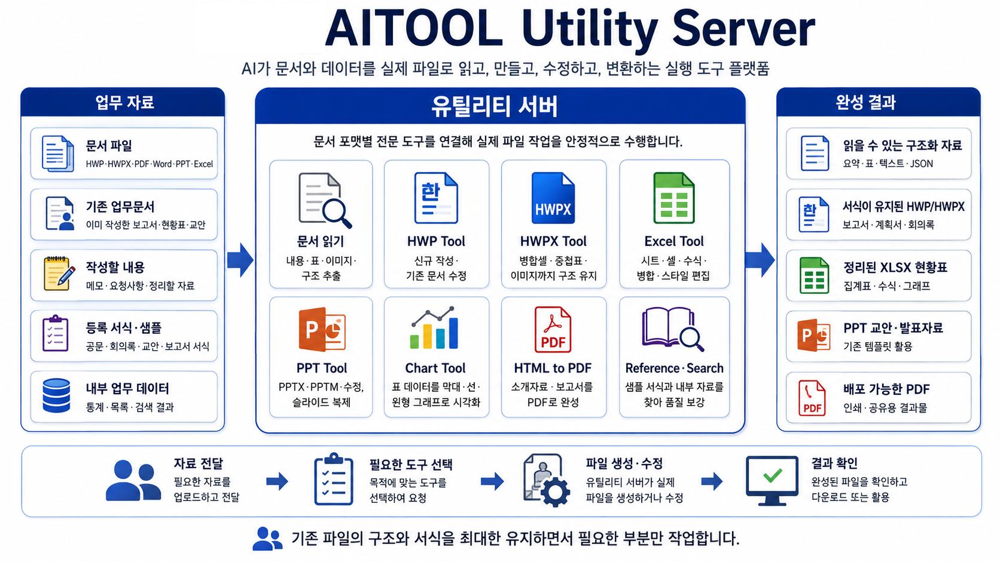

<b>유틸리티 서버가 하는 일</b>

  유틸리티 서버는 AI가 직접 다루기 어려운 문서 포맷을 실제로 처리하는 실행 기반입니다. 문서파일 읽기부터 신규파일 생성, 기존 파일 수정, 이미지 해석, 차트 생성, PDF 변환 등 업무에 필요한 도구를 한곳에 모아서 서버로 구축하였습니다.

​##다양한 문서파일 읽기
  - HWP, HWPX, DOC, DOCX, PPT, PPTX, PPTM, XLS, XLSX, PDF, TXT 같은 다양한 문서 파일을 읽고 Markdown, 텍스트, JSON 형태로 구조화 합니다. 단순 본문만 빠르게 추출할 수도 있고 표와 이미지, 문서의 구성정보를 분리해서 활용할 수 있도록 추출하는 기능도 수행합니다. 문서 내부의 이미지를 본문과 분리하여 제공하거나 필요한 경우 서버에 있는 Vision AI를 활용해 이미지 내용까지 본문문서와 결합해 전체 내용을 AI가 그대로 이해할 수 있도록 제공합니다.

​##HWP와 HWPX 문서 작성
  - 대한민국의 공공기관에서 HWP 문서는 가장 중요한 포맷입니다. 각 종 보고서, 회의록, 계획서 등 한글문서가 사용되지 않는 영역은 없습니다. 클로드나 GPT같은 프런티어 AI서비스들이 개방형 포맷인 HWPX를 지원하기 시작했지만 아직까지 90% 이상의 문서는 HWP 포맷이며 유틸리티 서버에 있는 HWP Tool API는 사용자의 변환과정없이 파일 그대로 수정하거나 생성하는 작업을 지원합니다. 

​##레퍼런스 기반의 등록 서식 문서 작성
  - 통상적으로 자주 사용되는 문서는 등록된 HWP 서식 파일을 활용할 수 있습니다. 아직 많지는 않지만 6종의 규정서식이 등록되어 있고 서식을 확장하는 작업을 진행하고 있습니다. AI는 요청에 맞는 서식과 필요한 항목만 확인하여 내용만 채우면 되고 서식에 필요한 결재선, 표의 배치, 문서 스타일 등은 새로 만들 필요가 없습니다. 같은 유형의 문서가 어떤 형식으로 구성되어 있는지, 어떤 문체를 사용하는지, 스타일은 어떻게 구성하는지를 참고할 수 있도록 데이터를 제공하는 역할을 레퍼런스 API가 수행하는데 이를 통해 AI가 작성한 문서의 결과품질을 적정수준까지 보장할 수 있도록 해줍니다.

##Excel 현황표와 차트
  - 유틸리티 서버에 내장된 Excel tool은 XLSX파일의 시트, 셀, 스타일, 수식, 병합 정보 등을 읽고 수정합니다. 기존 파일의 숫자만 갱신하거나 새로운 집계표를 구성하는 작업에 적합합니다. Chart API는 문서 도구와 별개로 차트 생성을 담당합니다. AI가 정해준 범주, 계열, 값, 색상 같은 차트 정보에 따라 막대, 선, 원형 등의 차트 이미지를 PNG파일로 생성합니다. 생성된 차트 이미지는 HWP, PPT같은 문서파일에 삽입될 수 있습니다. 

​##PPT 교안과 발표자료
  - PPT Tool은 PPTX와 PPTM 파일을 읽고 수정합니다. 가장 많은 업무인 강의교안 작업에서는 업무부서에서 정의된 슬라이드 서식을 유틸리티 서버에 내장하였고 이를 우선으로 활용합니다. AI가 새로운 디자인을 만드는 것도 가능하지만 강의교안은 등록된 슬라이드 서식 중에 내용에 맞는 서식을 고르고 텍스트와 이미지를 채우는 방식입니다. 개인별 강의교안 템플릿이 제공되므로 템플릿에 등록된 슬라이드 서식을 활용하여 완성된 강의교안을 만들수 있도록 지원합니다.

​##HTML기반 PDF변환
  - AI가 가장 잘 다루는 파일형태인 HTML을 활용하여 소개자료,안내문, 보고서 등을 웹형식으로 만들고 PDF로 완성하는데 사용합니다. 글꼴, 여백, 이미지 같은 구성요소를 조정한 뒤 PDF로 변환할 수 있어 인쇄하거나 배포하는데 목적으로 활용할 수 있습니다.

​##내부 데이터 검색과 벡터DB 기반 지식 검색
  - Search API는 내부 시스템에 등록된 데이터 조회를 담당합니다. 그동안 기관에서 쌓아왔던 지식기반 정보를 의미탐색하여 사용하는 벡터DB 검색기능과 숫자중심의 통계업무를 지원하는 레거시 데이터베이스 검색기능을 제공합니다. 숫자기반 데이터들은 공개해야 하는 정보인 경우가 많으므로 Search API는 LLM이 접근할 수 있는 정보를 알려주고 LLM이 요청한 정보를 기준으로 데이터를 집계하여 반환합니다.

​  LLM에게 전송하는 데이터는 기존 업무시스템에서 제공하는 방식과 달라야 합니다. A형태 보고서에는 A형태의 DB데이터를 전송해주고 B형태 보고서에는 B형태의 DB데이터를 전송해 주는 전통적인 방식이 아니라 LLM이 A나 B형태의 보고서를 만들수 있도록 해당 업무의 DB 테이블에서 개인정보를 제거하고 Z라는 전혀 새로운 형태의 데이터를 전송해주어야 합니다. LLM이 해당 업무 DB에서 검색할 수 있는 정보를 파악하고 사용자 요구에 따라 집계할 방법을 선택해서 Search API에 요청하도록 해줘야 하므로 해당업무의 전체 보고서를 모두 수용할 수 있는 구조로 설계가 되어야 한다는 의미입니다.

  벡터DB 기반 검색은 규정, 법령, 특정 업무자료들을 잘게 나누어 검색 인덱스에 저장하고 질문과 관련된 부분을 찾아 AI의 답변이나 문서 초안에 근거로 활용합니다. 검색결과만으로 결론을 내리기보다 필요한 경우 원문을 다시 확인하도록 구성하여 정확성과 추적가능성을 함께 고려하였습니다.

​

​

<b>어떤 업무에 대응하는가?</b>

  LLM이 정확한 정보를 참고하여 판단할 수 있도록 제공하는 RAG(Retrieval-Augmented Generation) + 결과 완성을 위한 Document Tool을 연결해 다양한 업무에 활용할 수 있습니다.

- 회의자료와 메모를 활용하여 회의록 서식으로 작성할수 있습니다.
- 여러 가지 자료를 읽고 분석하거나 정리하여 보고서, 계획서 등 검토용 자료를 만들 수 있습니다.
- 기존 HWP문서를 수정하는 형태의 반복적인 업무에 대응할 수 있습니다.
- 교수자가 작성한 강의내용을 활용하여 PPT 강의교안 파일을 제작할 수 있습니다.
- 내부 데이터베이스를 조회하여 현황을 분석하고 집계결과를 원하는 문서파일로 생성할 수 있습니다.
- 규정, 법령 같은 기준 지식에서 근거를 찾아 답변이나 문서를 작성 할 수 있습니다.
- 생성형 AI를 활용해 문서를 HTML파일로 제작하고 PDF로 변환하여 배포할 수 있습니다.

​아래는 이 시스템을 활용해 적용해본 예시들입니다.

1. 오픈소스 AI와 Search API를 활용해서 기존 업무시스템에 규정 및 법령 검색을 제공하였습니다.

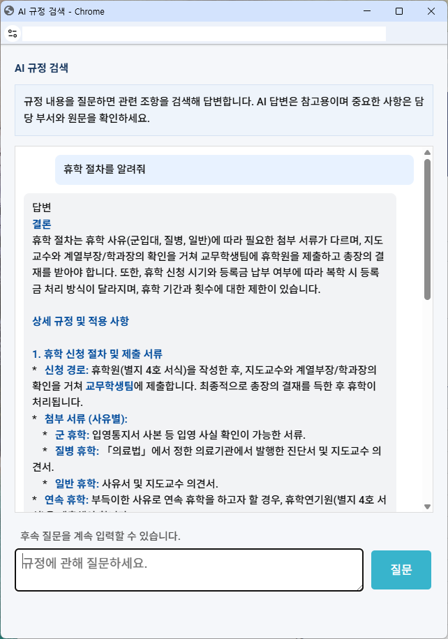 

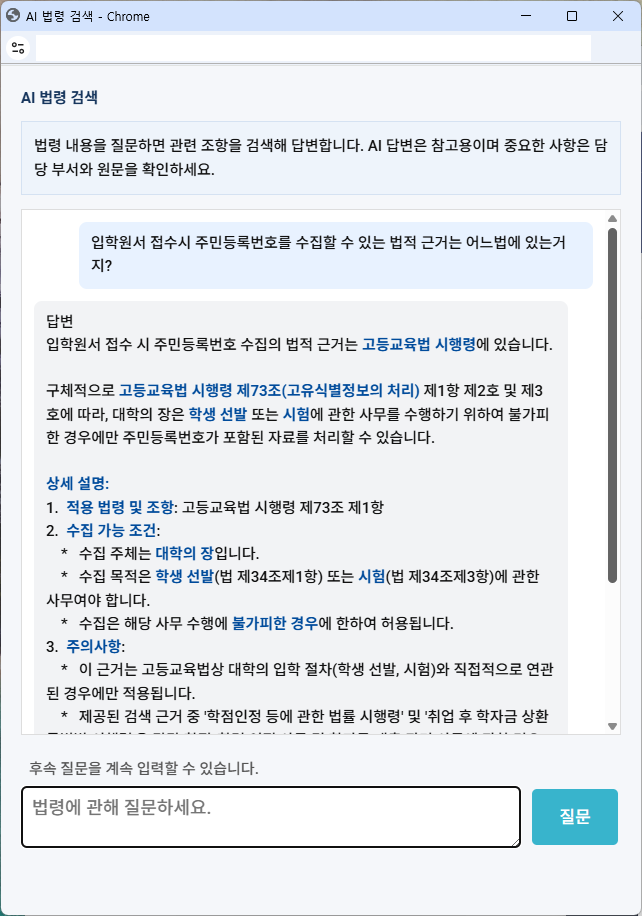 

​

2. 내부 데이터를 검색하여 분석결과를 통계자료로 제작해 보았습니다. LLM이 집계된 정보를 분석하고 PPT tool을 이용하여 완성된 PPT파일을 제작할 수 있습니다.(사용된 프롬프트는 '2025년 1학기 재학생 현황을 입학전형별로 분석해서 간단한 리포트를 PPT파일로 만들어줘' 입니다.)

​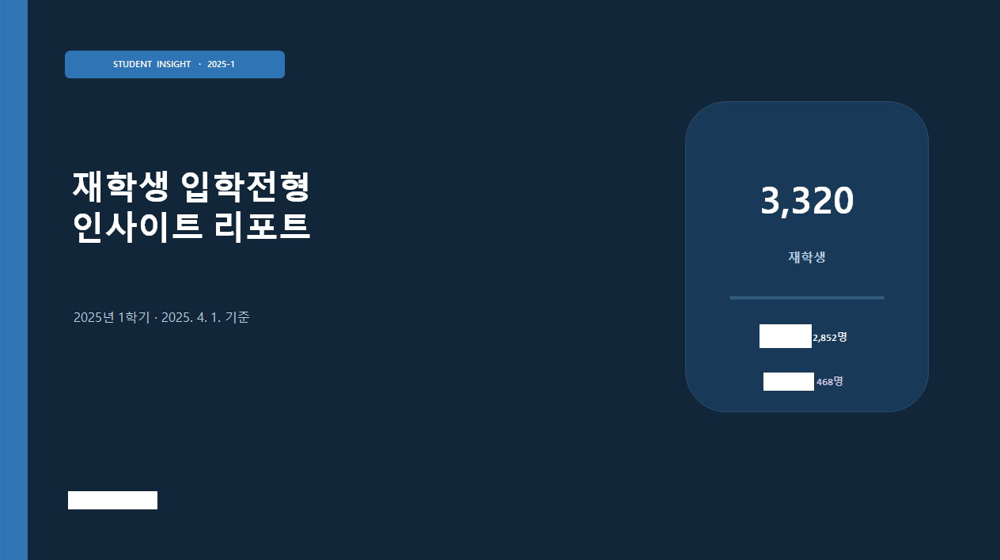 
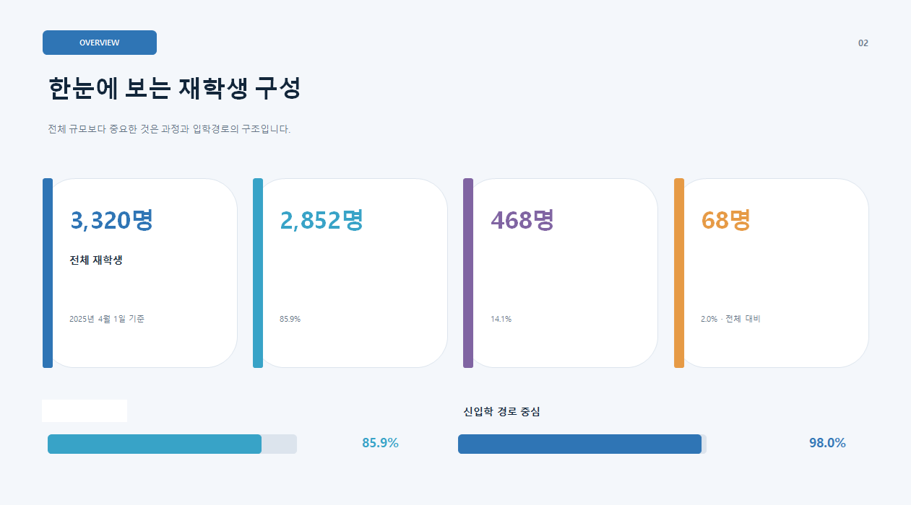 
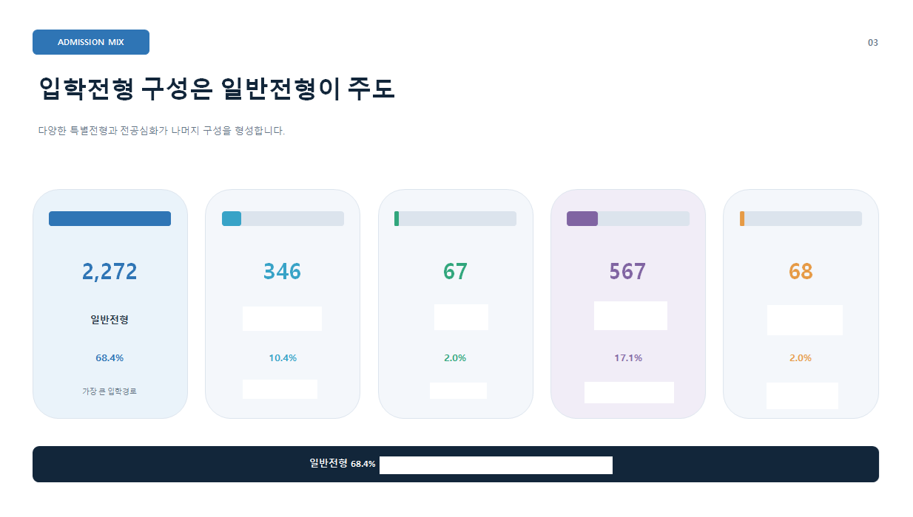 
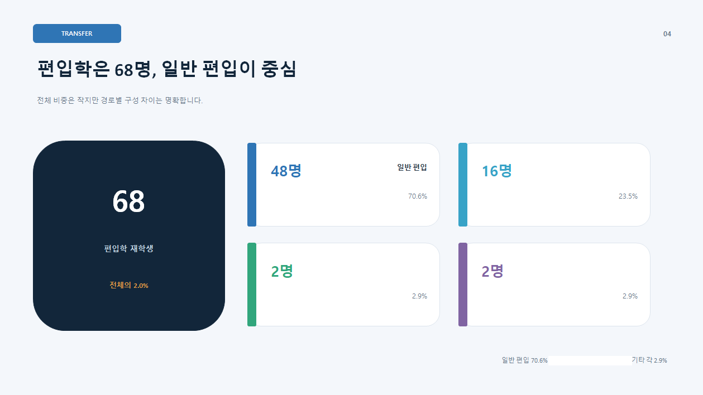 
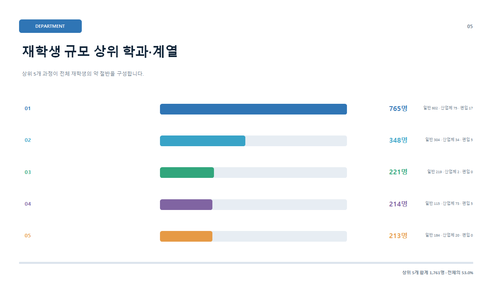 
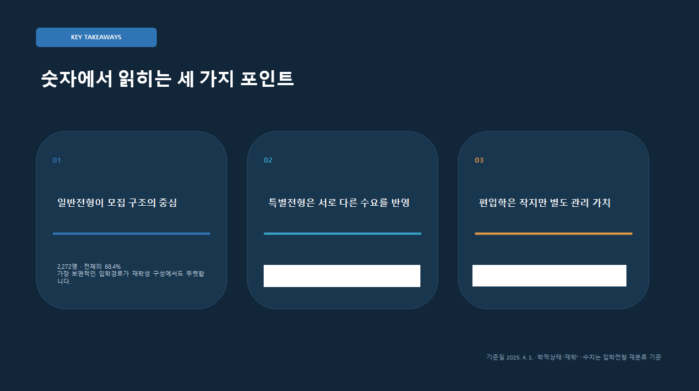 

 

 

 

​

​

<b>앞으로의 방향은 무엇인가?</b>

 이 플랫폼은 "AI가 만들어 냈다"가 아니라 사람이 실제로 검토하고 사용할 수 있는 결과물을 만드것이 중요한 역할입니다. 이를 위해 워크플로우는 요청에 맞는 작업순서를 정하고 전용도구는 문서포맷의 구조와 서식을 활용해 실제 파일을 처리하며 레퍼런스와 검색은 문서의 내용 구성과 근거를 보강합니다. 이 세가지 요소가 함께 작동해야 AI가 작성한 초안이 실무에 가까운 결과물로 이어질 수 있습니다.

  최종 검토와 판단은 사람의 몫입니다. 시스템이 하는 역할은 반복적인 정리와 형식적인 작업을 줄이고 분석하기 힘들었던 대량의 자료를 다양한 시각으로 볼 수 있도록 사용자의 목적에 맞는 자료를 AI에게 제공하는 것입니다. 거창한 자동화보다는 작은 문서 하나라도 사용자가 편하게 해주는데에서 가치를 찾습니다.

  앞으로는 AI로 많은 업무를 수행하게 될것이며 이제는 사람이 아닌 AI가 이해할 수 있는 형태로 데이터를 가공해야 할 것입니다. 또한 단위업무절차를 워크플로우로 변환하여 사용자가 업무에 능숙하지 않더라도 AI가 규정과 절차에 따라 사용자를 보조할 수 있도록 구축해 나가야 합니다. 오랜 시간이 걸리겠지만 이런 작은 변화가 쌓이면 언젠가는 AX업무전환이 이루어질거라 생각해봅니다.
