# AI에게 덧셈을 시켰다가 Search API를 다시 만들게 된 이야기

AITOOL에 내부 데이터베이스의 정보를 자연어로 검색할 수 있는 Search API를 만들면서 재미있는 문제를 하나 경험했습니다. 처음에는 AI가 사용자의 질문을 이해하고 필요한 조건으로 DB를 검색한 뒤, 그 결과를 정리해서 답변하면 된다는 비교적 단순한 구조로 시작했습니다. 개인정보를 AI에게 전달하지 않고 통계에 필요한 항목만 별도의 View로 구성하고, AI가 생성한 검색 조건에 따라 서버가 집계된 결과만 반환하도록 만들었습니다.

예를 들어 사용자가 "2026년 4월 1일 기준 학과별 재학생과 휴학생 현황을 알려줘"라고 요청하면 LLM이 기준일, 학적상태, 학과 등의 조건을 판단합니다. 이 조건을 Search API의 JSON 규격으로 만들어 요청하면 Oracle DB에서 조건에 맞는 학생 수를 집계해서 반환하고, LLM은 그 결과를 사람이 읽기 좋은 형태로 설명합니다. 처음 테스트했을 때는 생각했던 것보다 자연어 요청을 검색 조건으로 변환하는 작업을 잘해서 꽤 만족스러웠습니다.

구조 자체도 처음에는 복잡하지 않았습니다. 사용자의 질문을 LLM이 Search API 요청으로 바꾸고, 서버가 Oracle DB를 조회해서 결과를 반환하면 LLM이 최종 답변을 만드는 방식이었습니다. 지금 생각하면 이 구조에 작은 문제가 하나 숨어 있었는데, 당시에는 별로 문제라고 생각하지 않았습니다.

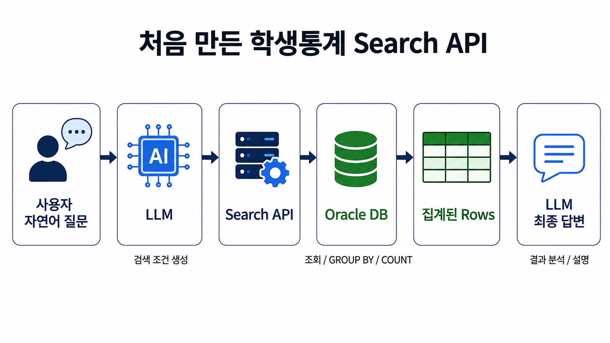

## DB에서 가져온 숫자는 맞는데 합계가 안 맞았습니다

Search API를 조금씩 확장하면서 여러 개의 Row를 조회하고 전체 합계를 같이 알려주는 테스트를 시작했습니다. 예를 들어 학과별 학생 수를 조회하면 Oracle에서 학과별 `COUNT` 결과를 반환하고, LLM은 각 학과의 학생 수를 설명하면서 필요하면 전체 학생 수도 함께 알려주는 방식입니다. DB에서 이미 숫자를 조회해서 전달했으니 여러 개의 숫자를 더하는 정도는 LLM에게 맡겨도 별문제가 없을 것이라고 생각했습니다.

그런데 테스트를 반복하다 보니 이상한 결과가 보이기 시작했습니다. Search API가 반환한 각각의 Row를 확인해보면 숫자는 모두 맞는데 Qwen3.6 27B가 최종 답변에서 알려주는 전체 합계가 맞지 않는 경우가 있었습니다. 처음에는 Search API나 SQL의 문제라고 생각해서 DB에서 직접 조회해보고 API가 반환한 결과도 다시 확인했지만 개별 데이터에는 문제가 없었습니다.

### [실제 화면 1 - Qwen3.6의 잘못된 합계]

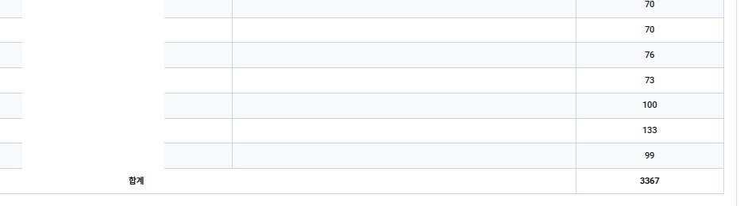

처음에는 제가 계산을 잘못했나 싶어서 Excel에 숫자를 넣고 다시 합산해봤습니다. 사실 이때까지만 해도 LLM이 단순한 합계를 계속 틀릴 것이라고 생각하지는 않았기 때문에 Search API에서 뭔가 하나를 빠뜨렸을 가능성을 더 의심했습니다. 그런데 Excel에서 `SUM`으로 계산한 결과와 Qwen이 알려준 합계를 비교해보니 실제로 값이 달랐습니다.

### [실제 화면 2 - Excel을 이용한 검산]

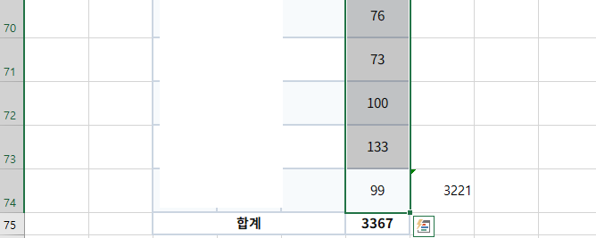

몇 차례 다시 요청하면 정상적인 합계가 나오기도 했고 다른 데이터에서는 또 잘못된 결과가 나오기도 했습니다. Row의 수가 많아질수록 이런 결과를 신뢰하기는 더 어려웠습니다. AI가 자연어를 이해해서 검색 조건을 만들고 API까지 호출하는 복잡한 작업은 잘하고 있는데, 마지막에 숫자 몇 개를 더하다가 틀린다는 것이 조금 황당하기도 했습니다.

## 처음에는 프롬프트를 고쳐보았습니다

처음 생각한 해결방법은 당연히 프롬프트였습니다. "각 Row의 값을 정확하게 합산하십시오", "합산 결과를 다시 검증하십시오" 같은 지시를 추가해보았고, 실제로 조금 나아지는 것처럼 보이기도 했습니다. 하지만 몇 번 더 테스트하다 보면 다시 잘못된 결과가 나왔습니다.

그래서 조금 다른 방법도 시도해봤습니다. 마침 다른 장비에서 Qwen3 14B를 운영하고 있었기 때문에, Qwen3.6 27B가 만든 결과를 Qwen3 14B에게 다시 검산시키면 어떨까 하는 생각이 들었습니다. 원본 데이터와 Qwen3.6의 결과를 함께 전달하고, 합계가 틀렸으면 수정해서 결과만 반환하도록 프롬프트를 만들어 넣었습니다.

나름 그럴듯한 방법이라고 생각했습니다. 첫 번째 LLM이 계산을 잘못하더라도 두 번째 LLM이 독립적으로 다시 계산하면 오류를 잡아낼 수 있을 것 같았고, 일종의 Reviewer나 Validator를 하나 더 붙인 셈이었습니다. 적어도 단순한 덧셈 정도라면 두 번 확인하면 좀 낫지 않을까 싶었습니다.

**그런데 그놈 역시 똑같았습니다.**

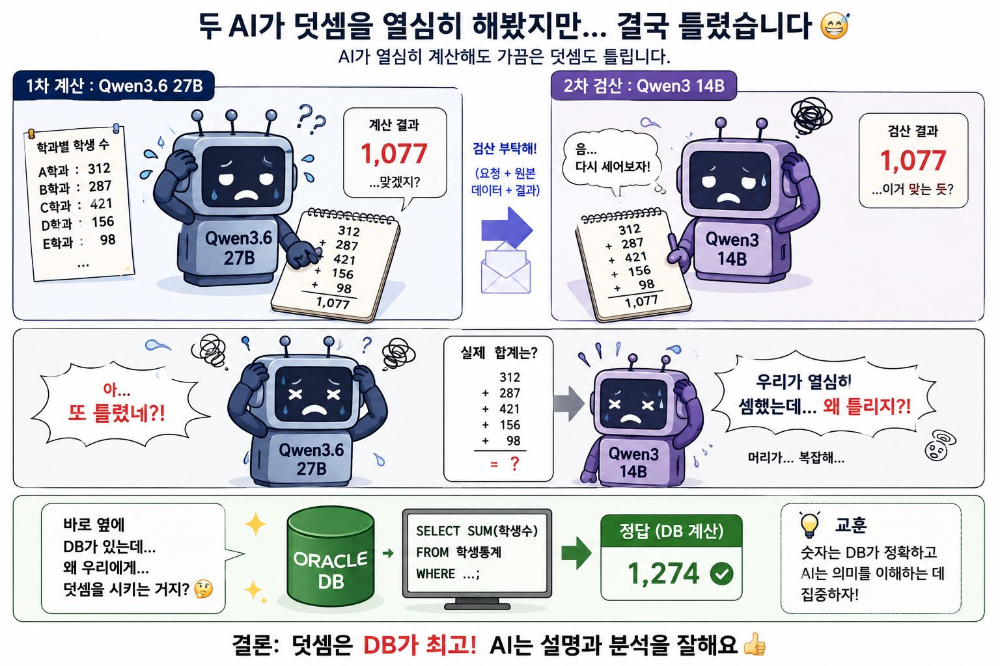

Qwen3.6 27B가 잘못 계산한 결과를 Qwen3 14B에게 검산시키고 틀렸으면 고치라고 했는데, 이쪽에서도 잘못된 합계가 나오는 경우가 있었습니다. 모델을 하나 더 붙였으니 호출 과정과 프롬프트는 더 복잡해졌는데, 정작 제가 필요했던 숫자의 정확성은 여전히 보장되지 않았습니다.

이쯤 되니 구조가 조금 우스워졌습니다. 첫 번째 AI에게 숫자를 더하게 하고, 혹시 틀릴까 걱정되어 다른 장비에 있는 두 번째 AI에게 같은 숫자를 다시 더하게 한 다음, 둘 중 하나가 제대로 계산하기를 기대하고 있었습니다. 통계자료에서 "대부분 맞는다"는 것은 별 의미가 없는데, 저는 정확도를 높이겠다며 확률적인 계산을 한 번 더 하고 있었습니다.

100번 중 99번 정확하더라도 중요한 보고서에서 한 번 틀리면 결국 전체 결과를 다시 검산해야 합니다. 그렇게 되면 자연어로 통계를 조회해서 업무를 줄이겠다는 Search API를 만들어놓고 사람이 다시 Excel을 열어서 합계를 확인해야 합니다. 그리고 이쯤에서 아주 기본적인 의문이 하나 생겼습니다.

**Oracle DB를 바로 옆에 두고 왜 LLM 두 대에게 번갈아 덧셈을 시키고 있을까?**

Oracle에서는 그냥 SUM() 한 번이면 정확하게 처리할 수 있는 일이었습니다. 결국 Qwen3.6이 계산을 틀렸고 Qwen3 14B를 붙여도 해결되지 않았다는 것이 문제의 시작이기는 했지만, 정확성이 반드시 보장되어야 하는 계산을 확률적인 모델에게 맡긴 구조 자체가 더 근본적인 문제라는 생각이 들었습니다.

## AI와 DB가 잘하는 일을 다시 나누었습니다

Qwen3.6 27B를 사용하면서 자연어 요청을 이해하고 필요한 검색 조건을 만드는 능력에는 상당히 만족하고 있습니다. "최근 5년간 학과별 재학생 변화를 보여줘" 같은 요청에서 `최근 5년`, `학과별`, `재학생`, `변화`라는 의미를 파악하고 어떤 조건으로 데이터를 조회해야 하는지를 판단하는 것은 LLM이 잘하는 영역입니다. 이런 부분은 기존 프로그램에서 수많은 조회 화면과 검색 조건을 만들어야 했던 방식과 비교하면 상당히 재미있는 변화라고 생각합니다.

반대로 이미 조회된 숫자들을 정확하게 더하는 것은 자연어를 이해할 필요도 없고 추론할 필요도 없습니다. 답은 하나로 정해져 있고 같은 입력에는 언제나 같은 결과가 나와야 합니다. 그래서 LLM은 사용자의 의도를 이해하고 필요한 작업을 결정하는 역할을 담당하고, 서버와 DB는 실제 조회와 계산처럼 결과의 정확성이 필요한 작업을 담당하도록 역할을 다시 나누었습니다.

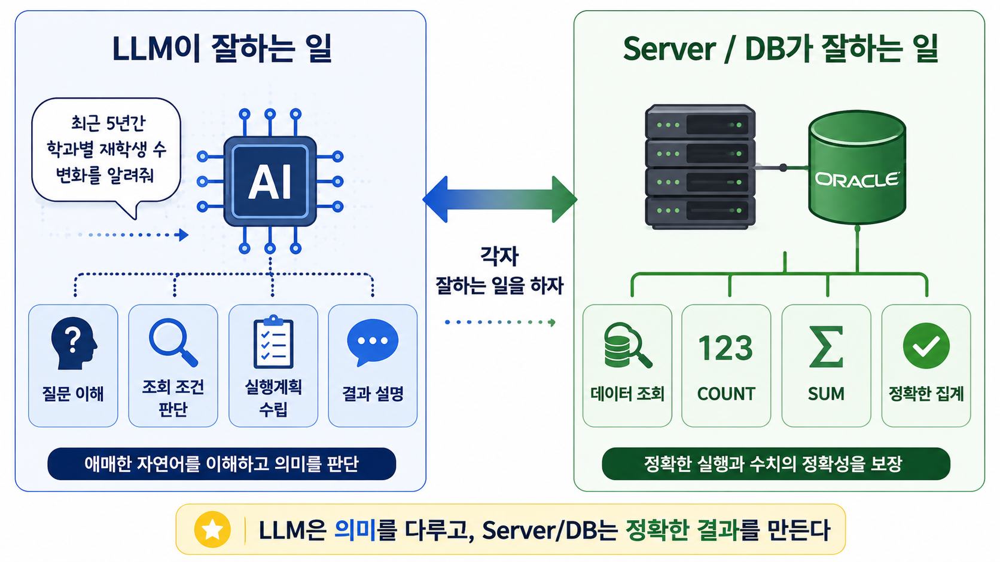

## 합계는 Rollup으로 다시 계산하도록 변경했습니다

우선 가장 직접적인 문제였던 합계를 LLM이 계산하지 않도록 변경했습니다. Search API에서 상세 Row를 조회하는 것은 기존과 동일하지만, 전체 합계가 필요한 조건은 별도로 분리해서 서버에서 다시 `SUM`으로 집계하고 이 값을 Rollup 결과로 함께 반환하도록 했습니다. LLM에게는 상세 내용을 설명하기 위한 Rows와 서버가 정확하게 계산한 Rollup 결과를 같이 전달합니다.

예를 들어 학과별 학생 수가 여러 Row로 반환되더라도 LLM이 이 숫자들을 다시 더하지 않습니다. 각 학과의 현황을 설명할 때는 Rows를 사용하고 전체 학생 수가 필요할 때는 Rollup에 포함된 값을 사용합니다. 계산의 책임을 DB로 돌려놓으니 합계를 정확하게 만들기 위해 프롬프트를 수정하거나 결과를 다시 검증하도록 LLM에게 지시할 필요도 없어졌습니다.

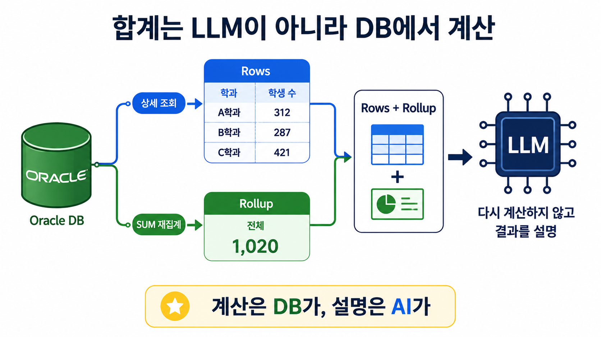

이 정도에서 처음 발견했던 합계 문제는 해결되었습니다. 그런데 Rollup을 붙이고 Search API를 계속 테스트하다 보니 처음 설계할 때는 크게 생각하지 않았던 다른 문제가 하나 더 눈에 들어왔습니다. 실제 사용자가 자연어로 질문하면 한 번의 질문이 항상 한 번의 Search로 끝나지는 않는다는 점이었습니다.

## 한 번의 질문이 한 번의 Search라는 보장은 없었습니다

처음 Search API는 한 번의 요청으로 하나의 검색을 수행하도록 만들었습니다. "2026년 1학기 학과별 재학생 수를 알려줘"처럼 조건이 명확한 질문이라면 한 번 Search하고 결과를 반환하면 되기 때문에 이 구조로도 충분했습니다. 실제로 처음 기능을 만들 때는 기존에 사용하던 여러 통계 조회를 하나의 Search API 규격으로 처리할 수 있는지가 더 중요한 관심사였습니다.

하지만 사용자가 "최근 몇 년간 학과별 재학생 수를 비교하고 전체 학생 수의 변화도 같이 알려줘"처럼 질문하면 이야기가 달라집니다. 하나의 Search 조건으로 해결할 수 없다면 LLM이 첫 번째 Search를 요청하고 결과를 받은 뒤 두 번째 Search를 다시 요청해야 합니다. 필요한 조회가 많아질수록 LLM이 검색 실행뿐 아니라 중간 결과와 다음 작업까지 계속 관리해야 하는 구조가 됩니다.

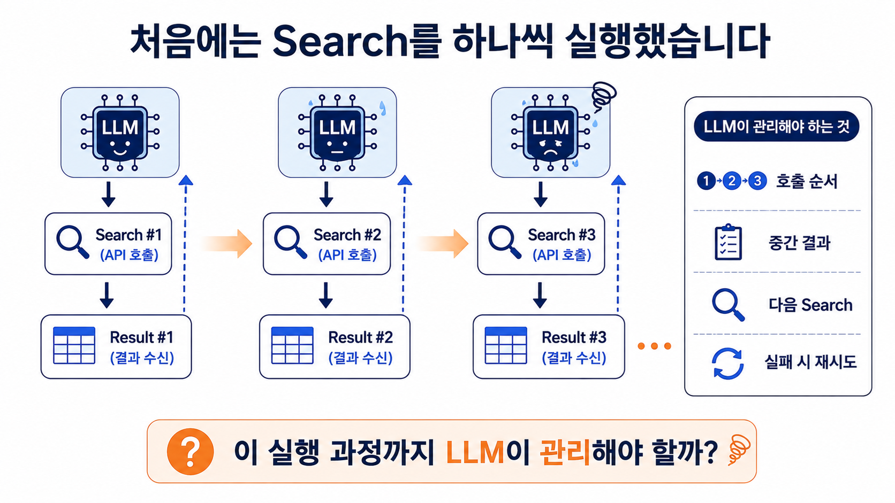

Rollup 문제를 해결하고 나서 이 구조를 다시 보니 비슷한 생각이 들었습니다. 합계처럼 서버가 더 안정적으로 처리할 수 있는 작업을 굳이 LLM에게 맡길 필요가 없었던 것처럼, 이미 결정된 여러 Search의 실행 순서와 결과 수집까지 LLM이 하나씩 관리할 필요가 있을까 하는 생각이었습니다. 그래서 LLM에게 Search를 바로 실행시키기보다 먼저 필요한 작업 전체를 계획하도록 구조를 바꾸어 보기로 했습니다.

## Search를 여러 번 시키지 않고 실행계획을 먼저 받았습니다

사용자의 요청을 해결하기 위해 여러 번의 조회가 필요하면 LLM은 각각의 Search를 즉시 실행하는 대신 먼저 전체 실행계획을 만듭니다. 필요한 Search 요청들을 Queue에 담아서 Executor에게 한 번에 전달하고, Executor는 Queue에 들어 있는 요청들을 실제 Search API에 전달해서 결과를 수집합니다. LLM 입장에서는 어떤 데이터가 필요한지만 결정하면 되고 실제 실행과 결과 수집은 서버에서 처리하게 됩니다.

이렇게 하면 Search가 한 번이든 다섯 번이든 LLM과 Search API 사이를 계속 왕복할 필요가 없습니다. Executor가 정해진 계획대로 작업을 수행하고 모든 결과를 하나의 Result Package로 만들어 반환하면 LLM은 그 결과를 바탕으로 사용자의 질문에 답변하면 됩니다. 실행 과정에서 오류가 발생했을 때 재시도나 결과 확인 같은 기능을 추가하기에도 이쪽이 더 자연스러운 구조라고 생각했습니다.

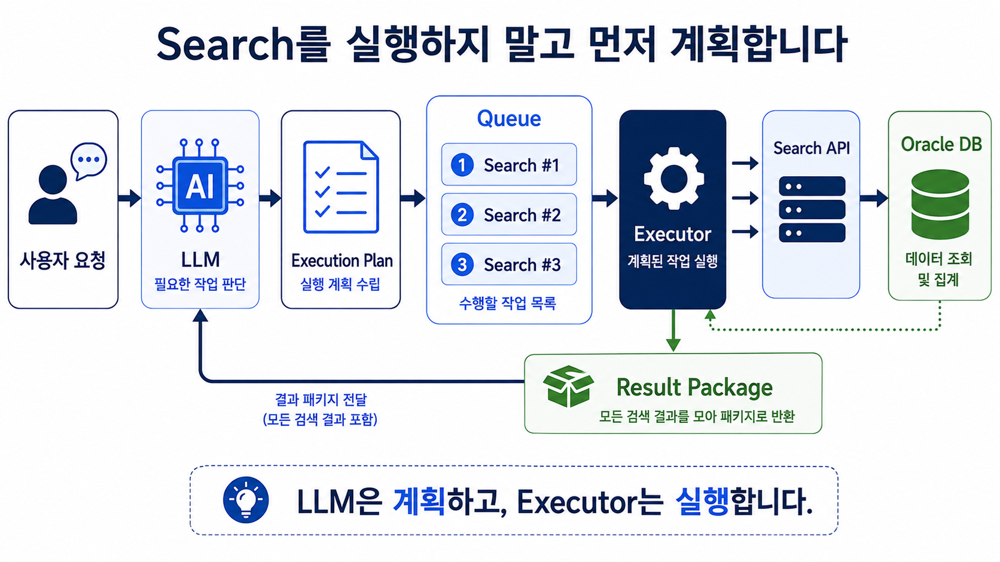

## Rollup도 Executor의 실행 결과에 포함시켰습니다

Executor를 만들고 나니 앞에서 추가했던 Rollup도 이 실행 과정에 포함시키는 것이 자연스러웠습니다. LLM이 만든 Execution Plan에 여러 Search 요청이 들어오면 Executor가 각각을 실행하고 결과를 수집합니다. 이때 요청 조건 중 `SUM`으로 합산 가능한 조건을 별도로 분리해서 전체 합계를 DB에서 다시 계산하고, 각각의 Search 결과와 Rollup 결과를 함께 Result Package로 구성합니다.

최종적으로 LLM에게 전달되는 것은 단순히 여러 개의 DB Row를 모아놓은 데이터가 아닙니다. 사용자가 요청한 상세 검색 결과와 서버에서 정확하게 다시 계산한 합계가 함께 전달됩니다. LLM은 이 결과를 이용해서 비교하거나 의미를 설명하면 되고, 전체 합계를 만들기 위해 수십 개의 숫자를 다시 더할 필요는 없습니다.

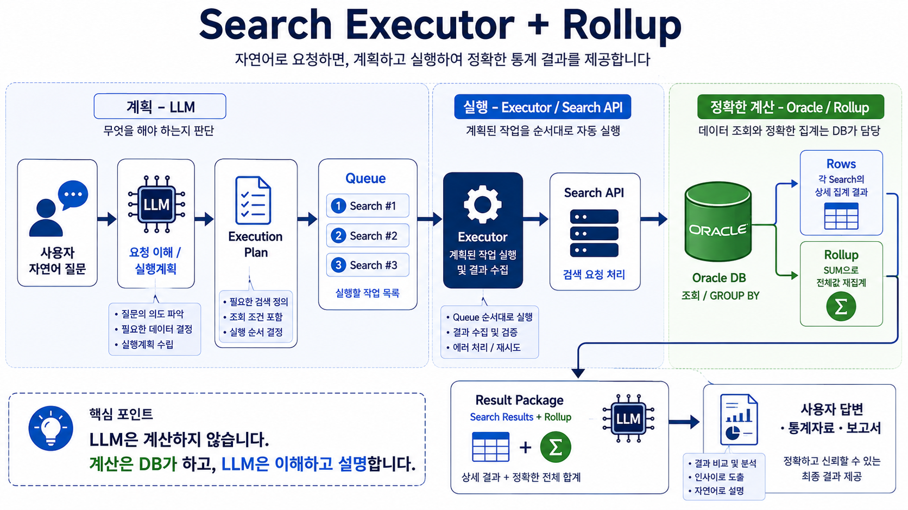

처음에는 단순히 자연어로 DB를 조회하는 Search API를 만들고 있다고 생각했는데, 이 구조까지 만들고 보니 처음과는 역할이 조금 달라졌습니다. LLM이 직접 Search를 하나씩 호출하는 것이 아니라 사용자의 요청을 작은 실행단위로 나누어 계획하고, 서버의 Executor가 그 계획을 받아 실제 작업을 수행하는 형태가 되었습니다. 그리고 정확성이 필요한 계산은 LLM의 결과에 의존하지 않고 DB에서 별도로 보장하도록 했습니다.

## 덧셈 하나 고치다가 Executor까지 만들었습니다

처음 문제는 정말 단순했습니다. Qwen3.6 27B가 DB에서 정확하게 조회된 숫자들을 받아놓고 마지막 합계를 잘못 계산하는 경우가 있다는 것이었습니다. 처음에는 프롬프트를 조금 수정하면 해결될 문제라고 생각했는데, 그 문제를 따라가다 보니 정확한 계산을 왜 LLM에게 맡겼는지 다시 생각하게 되었고 결국 Rollup을 만들었습니다.

Rollup을 만들고 나서는 비슷한 질문이 하나 더 생겼습니다. 여러 번의 Search가 필요할 때 그 실행 과정까지 왜 LLM이 하나씩 관리하고 있는지 생각하게 되었고, 결국 Execution Plan과 Queue를 받아 실행하는 Executor를 추가했습니다. 덧셈 하나를 고치기 시작했는데 결과적으로 Search API의 실행 구조까지 바뀌게 된 셈입니다.

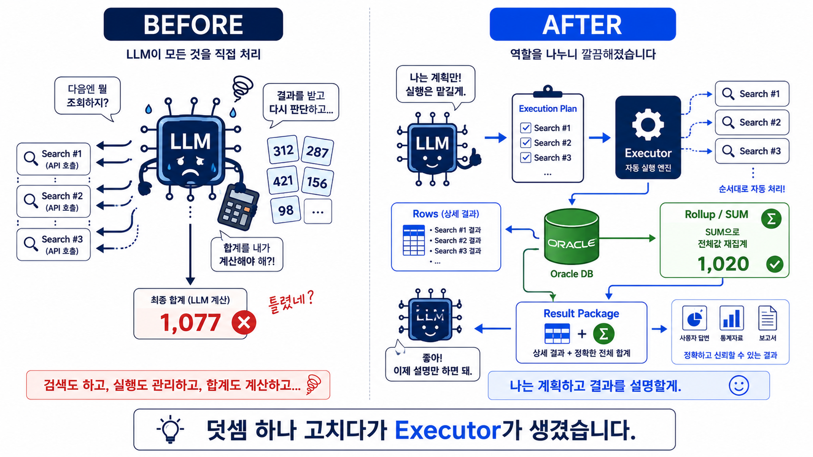

개발을 오래 해도 이런 경우는 계속 생기는 것 같습니다. 처음에는 특정 코드나 모델의 오류라고 생각해서 그 부분을 고치려고 하는데, 조금 더 따라가다 보면 실제 문제는 코드를 잘못 만든 것이 아니라 처음에 각 구성요소의 역할을 나눈 방법에 있는 경우가 있습니다. 이번에는 Qwen의 합산 오류가 그런 문제를 발견하게 해준 계기가 되었습니다.

## AI가 틀리지 않게 만드는 것보다 시스템이 틀리지 않게 만드는 것

이번 경험을 통해 LLM에게 어떤 일을 더 시킬 것인지 고민하는 것만큼 어떤 일을 시키지 않을 것인지 결정하는 것도 중요하다는 생각을 하게 되었습니다. LLM은 애매한 자연어를 이해하고 사용자가 원하는 것이 무엇인지 판단하거나, 여러 결과를 읽어서 사람이 이해하기 쉽게 설명하는 일을 상당히 잘합니다. 이런 능력 때문에 기존에는 미리 프로그램으로 만들어두기 어려웠던 요청도 자연어로 처리할 수 있게 되었습니다.

반면 숫자의 합계처럼 답이 하나로 정해져 있고 반드시 정확해야 하는 작업은 굳이 LLM이 할 필요가 없습니다. DB가 더 정확하게 할 수 있는 일은 DB에게 맡기고, 정해진 실행계획을 순서대로 수행하는 것은 Executor에게 맡기면 됩니다. LLM은 그 위에서 사용자의 요청을 이해하고 어떤 일을 해야 하는지를 판단하는 역할에 집중하는 편이 전체 시스템을 더 안정적으로 만들 수 있다고 생각합니다.

앞으로 모델의 성능이 더 좋아지면 이런 단순 계산 오류는 훨씬 줄어들 것입니다. 더 큰 모델을 사용하면 지금도 정확도가 높아질 수 있고, 언젠가는 이런 숫자들을 거의 틀리지 않고 계산할 수도 있을 것 같습니다. 그렇더라도 지금 만든 Rollup을 다시 제거하고 합계를 LLM에게 맡기지는 않을 것 같습니다. 모델이 계산할 수 있는 것과 업무 시스템에서 결과의 정확성을 보장하는 것은 서로 다른 문제라고 생각하기 때문입니다.

처음에는 몇 개의 숫자를 더했는데 결과가 이상해서 Excel을 열어 다시 계산해본 것이 시작이었습니다. 그 작은 오류를 따라가면서 Rollup을 만들었고, 여러 Search를 처리하는 방법까지 다시 고민하다 보니 Executor도 하나 생겼습니다. 계획했던 기능은 아니었지만 결과적으로 YCU_AITOOL에서 LLM과 서버의 역할을 조금 더 명확하게 나누는 계기가 되었습니다.

**AI에게 항상 정확한 답을 요구하는 것보다, AI가 가끔 틀리더라도 시스템의 결과는 틀리지 않도록 만드는 것이 더 중요하다는 것을 배운 삽질이었습니다.**

이제 합계가 정확하게 나오는 걸 보니 마음이 편안해졌습니다.

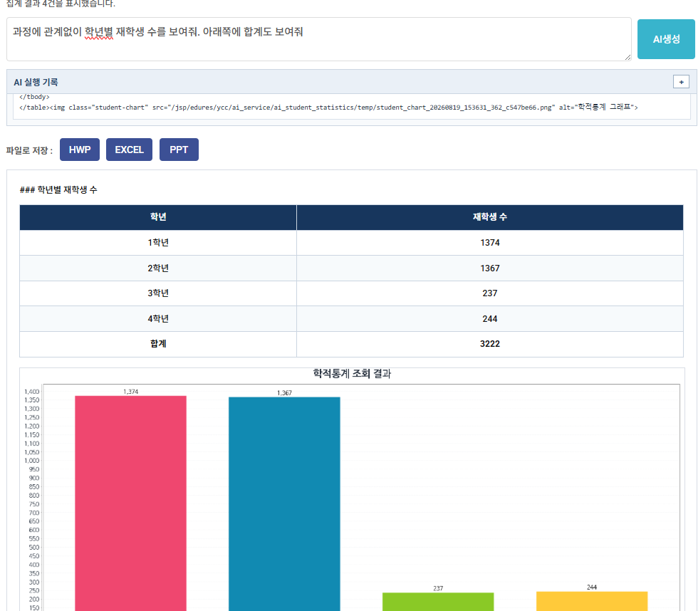
